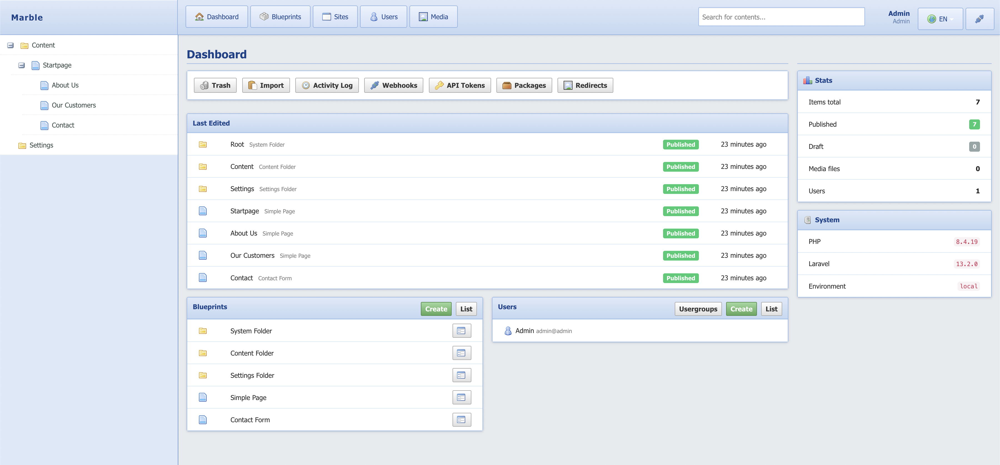
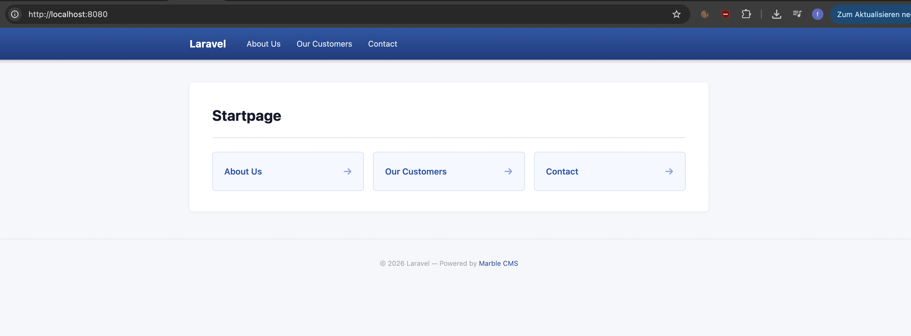

# Marble CMS — Demo App







This repository is a Laravel 13 application pre-configured to run the [Marble CMS](https://github.com/marblecms/admin) package. It serves as the reference implementation and development sandbox.

## Requirements

- Docker & Docker Compose

That's it. Everything else runs inside the container.

## Quick Start

```bash
git clone --recurse-submodules https://github.com/marblecms/demo
cd demo
cp .env.example .env
docker compose up -d
docker compose exec app php artisan marble:install
```

> **Note:** `--recurse-submodules` is required. The Marble CMS package lives in a [separate repo](https://github.com/marblecms/admin) and is linked here as a Git submodule under `packages/marble/admin`. Without the flag that directory will be empty and the app won't boot.
>
> Already cloned without the flag? Run:
> ```bash
> git submodule update --init
> ```

Open [http://localhost:8080/admin](http://localhost:8080/admin) and log in with:

```
Email:    admin@admin
Password: admin
```

## Services

| Service     | URL                          |
|-------------|------------------------------|
| Admin panel | http://localhost:8080/admin  |
| Frontend    | http://localhost:8080        |
| phpMyAdmin  | http://localhost:8081        |

Database: host `db`, name `marble`, user `marble`, password `marble`.

## Project Structure

```
routes/web.php           ← Frontend routing via Marble::routes()
resources/views/         ← Your Blade templates
packages/marble/admin/   ← The CMS package
```

## Frontend Templates

Marble resolves URL slugs to Items and renders Blade views from `resources/views/marble-pages/`. Name the view after the blueprint identifier:

```
resources/views/marble-pages/page.blade.php
resources/views/marble-pages/article.blade.php
resources/views/marble-pages/default.blade.php   ← fallback
```

Each view receives an `$item` instance:

```blade
@extends('layouts.app')

@section('content')
    <h1>{{ $item->value('title') }}</h1>
    <div>{!! $item->value('body') !!}</div>
@endsection
```

## Useful Commands

```bash
# First-time setup: migrate, seed, publish assets
docker compose exec app php artisan marble:install

# Re-publish admin assets after package updates
docker compose exec app php artisan vendor:publish --tag=marble-assets --force

# Run new migrations
docker compose exec app php artisan migrate
```

## License

MIT
