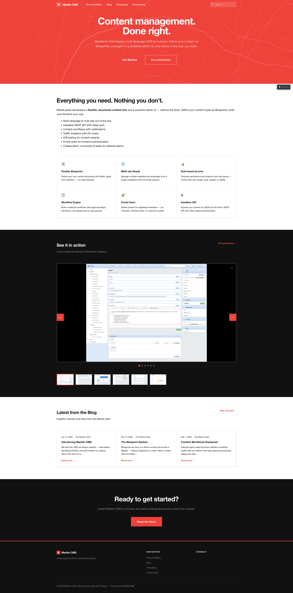
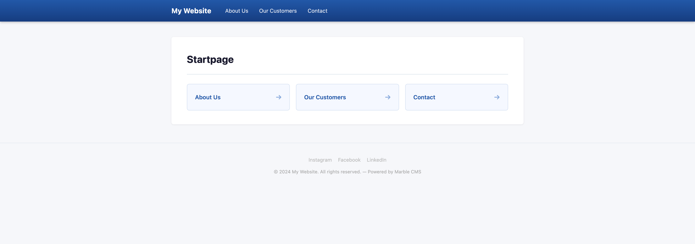

# Marble CMS — Demo App

<table>
<tr>
  <td width="100%" colspan="3"></td>
</tr>
<tr>
  <td width="33%"></td>
  <td width="33%"></td>
  <td width="33%"></td>
</tr>
<tr>
  <td width="33%"></td>
  <td width="33%"></td>
  <td width="33%"></td>
</tr>
</table>

A Laravel 13 application pre-configured to run the [Marble CMS](https://github.com/marblecms/admin) package. Use it as your starting point or development sandbox.

**[→ Full Documentation](https://github.com/marblecms/admin/wiki)**

## Requirements

- Docker & Docker Compose

That's it. Everything else runs inside the container.

## Quick Start

```bash
git clone --recurse-submodules https://github.com/marblecms/demo
cd demo
cp .env.example .env
docker compose up -d
docker compose exec app php artisan migrate:fresh --seed
docker compose exec app php artisan vendor:publish --tag=marble-assets
```

> **`--recurse-submodules` is required.** The Marble CMS package lives in a [separate repo](https://github.com/marblecms/admin) and is linked as a Git submodule under `packages/marble/admin`. Without it, that directory will be empty and the app won't boot.
>
> Already cloned without the flag?
> ```bash
> git submodule update --init
> ```

### Admin Panel

[http://localhost:8080/admin](http://localhost:8080/admin)

```
Email:    admin@admin
Password: admin
```

### Frontend

[http://localhost:8080](http://localhost:8080) — a full demo site with navigation, blog, products, contact form, and a portal-gated intranet.

Portal user ([/portal/login](http://localhost:8080/portal/login)):

```
Email:    demo@demo.com
Password: demo
```

### phpMyAdmin

[http://localhost:8081](http://localhost:8081) — host `db`, user/password `marble`.

---

## Seeded Demo Content

`migrate:fresh --seed` builds a complete site across **12 blueprints** and **33 items**:

```
Root/
├── Content/
│   └── Startpage  (home)                    ← site root
│       ├── About Us  (simple_page)
│       │   ├── Our Team  (simple_page)
│       │   │   ├── Alice Schmidt  (team_member)
│       │   │   ├── Bob Müller     (team_member)
│       │   │   └── Carol Weber    (team_member)
│       │   └── Our Story  (simple_page)
│       ├── Blog  (blog_index)
│       │   ├── Introducing Marble CMS 2.0   (blog_post, published)
│       │   ├── Building with Field Types    (blog_post, published)
│       │   ├── Multi-Site Made Easy         (blog_post, published)
│       │   ├── Content Workflows            (blog_post, draft — In Review)
│       │   └── Portal Users & Intranets     (blog_post, draft — Written)
│       ├── Products  (product_category)
│       │   ├── Software  (product_category)
│       │   │   ├── Marble CMS Pro
│       │   │   ├── Marble Analytics
│       │   │   └── Marble Headless
│       │   └── Services  (product_category)
│       │       ├── Implementation
│       │       ├── Support
│       │       └── Training
│       ├── Contact  (contact_form)
│       └── Intranet  (intranet_page)        ← portal-auth gated
│           ├── Internal News
│           │   ├── Q1 Results
│           │   └── New Vienna Office
│           ├── Documents
│           └── Team Directory
└── Settings/
    └── Site Settings  (site_settings)        ← branding, SEO, social, footer
```

Two draft blog posts demonstrate the **Blog Editorial Workflow**: Written → In Review → Approved → Published, with per-step permissions, deadline tracking, and reject-with-comment.

---

## Project Structure

```
app/Http/Controllers/
  FrontController.php        ← /marble-test/{id} dev helper (load item by ID)
  SearchController.php       ← GET /search full-text search across item_values

routes/web.php               ← /search + Marble::routes() catch-all

resources/views/
  layouts/
    frontend.blade.php       ← sticky header, 3-level CSS dropdown nav,
                                search bar, portal user indicator, dark footer
  marble-pages/
    home.blade.php            ← hero, feature grid, blog preview, product preview, CTA
    simple_page.blade.php     ← generic page with breadcrumbs + child grid
    blog_index.blade.php      ← post listing sorted by publish date
    blog_post.blade.php       ← post detail with prev/next navigation
    product_category.blade.php← subcategory grid + product cards with feature list
    product.blade.php         ← detail with sidebar pricing card + related products
    team_member.blade.php     ← profile with photo, bio, LinkedIn, team sidebar
    intranet_page.blade.php   ← portal-auth gate; sidebar nav tree when logged in
    contact_form.blade.php    ← form with contact info sidebar
    search.blade.php          ← results with keyword highlighting

config/marble.php             ← CMS configuration
packages/marble/admin/        ← the CMS package (git submodule)
```

---

## Frontend Templates

Marble resolves URL slugs to Items and renders Blade views from `resources/views/marble-pages/`. The filename matches the blueprint identifier:

```
marble-pages/{blueprint_identifier}.blade.php
```

Each view receives `$item`:

```blade
@extends('layouts.frontend')

@section('content')
    <h1>{{ $item->value('title') }}</h1>
    {!! $item->value('content') !!}

    @foreach(\Marble\Admin\Facades\Marble::children($item) as $child)
        <a href="{{ \Marble\Admin\Facades\Marble::url($child) }}">
            {{ $child->name() }}
        </a>
    @endforeach
@endsection
```

The layout reads all site-wide values (name, logo, meta tags, social links, copyright) from `Marble::settings()` — no hardcoded strings.

---

## Features Demonstrated

| Feature | Where to find it |
|---------|-----------------|
| 3-level CSS dropdown navigation | Layout header — `Marble::navigation(null, 3)` |
| Full-text search | `GET /search?q=…` → `SearchController` |
| Translation fallback | Edit any item in German/Slovak — untranslated fields fall back to English |
| Editorial workflow | Blog posts: Written → In Review → Approved; reject-with-comment at each step |
| Workflow deadlines | Configured on "In Review" step; overdue badge in item sidebar |
| Portal user auth | `/portal/login` — `marble.portal.auth` middleware |
| Intranet / gated content | `intranet_page` — shows login prompt unless portal-authenticated |
| Draft preview | Generate a shareable token URL for unpublished items from the sidebar |
| A/B Testing | Assign a Variant B to any item; track impression split in the sidebar widget |
| Content Bundles | Group items → publish or roll back as one atomic operation |
| Item subscriptions | Watch any item; receive in-app notifications on changes |
| Content Relations Graph | D3.js force-directed graph of item connections — linked from item sidebar |
| Inline children | `team_member` items as accordion panels inside "Our Team" |
| Contact forms | `contact_form` blueprint with `is_form` + `<x-marble::marble-form>` |
| Smart crops | Named crop presets (hero, thumbnail) — `$media->crop('hero')` |
| Headless REST API | `GET /api/marble/items/{blueprint}` with Bearer token |
| Marble Debugbar | Floating debug panel on frontend — enable with `MARBLE_DEBUGBAR=true` |
| Admin Themes | Win98 theme selectable per user in profile settings |
| Webhooks | HTTP callbacks on item.created / saved / published / deleted |

---

## Portal Users

The Intranet section requires a portal login. Portal users are managed under **System → Portal Users** in the admin — they are entirely separate from admin users.

Protect any route with middleware:

```php
Route::get('/members', MembersController::class)
    ->middleware('marble.portal.auth');
```

Check auth in Blade:

```blade
@if(\Marble\Admin\Facades\Marble::isPortalAuthenticated())
    Welcome, {{ Marble::portalUser()->email }}
@endif
```

Enable self-registration by setting `portal_registration = true` in `config/marble.php`.

---

## Contact Forms

The `contact_form` blueprint has **Is Form** enabled. Submissions are stored in the database and visible in the admin under the item's edit view. Notification emails go to the addresses configured per item.

```blade
<x-marble::marble-form :item="$item">
    <button type="submit">Send</button>
</x-marble::marble-form>
```

---

## Useful Commands

```bash
# Wipe and re-seed with full demo content
docker compose exec app php artisan migrate:fresh --seed

# Re-publish admin assets after package updates
docker compose exec app php artisan vendor:publish --tag=marble-assets --force

# Health check
docker compose exec app php artisan marble:doctor

# Process scheduled publish/expire
docker compose exec app php artisan marble:schedule-publish

# Notify overdue workflow steps
docker compose exec app php artisan marble:workflow-deadlines

# Prune old activity log + read notifications
docker compose exec app php artisan marble:prune

# Clear blueprint icon picker cache
docker compose exec app php artisan marble:clear-icon-cache

# Interactive blueprint + Blade view generator
docker compose exec app php artisan marble:make-blueprint

# Clear compiled Blade views
docker compose exec app php artisan view:clear
```

---

## License

MIT
